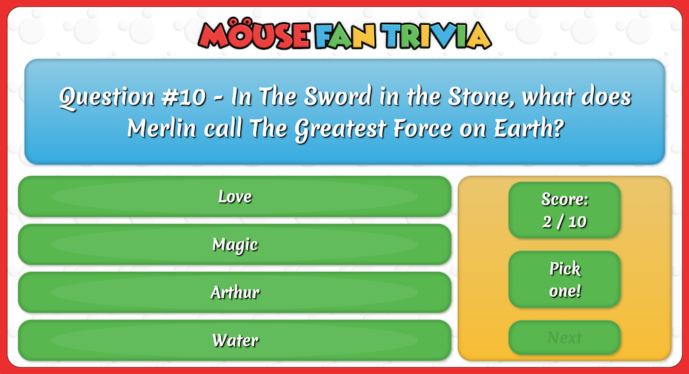

# Web Trivia Game - Mouse Fan Trivia
## Description
This is a web based trivia game designed with HTML, CSS, and Javascript and it's currently set up with various Disney related trivia questions. It current works in at most resolutions and on various mobile devices. It currently works best in Chrome. An current version is running at [http://mousetrivia.pureshift.com](http://mousetrivia.pureshift.com).

## Installation
All that you need to do is copy the files in the HTML folder of this repo on to your web host. No further software is required.

## Playing the Game
The game is self-explanatory. The user is given various prompts with a selection of four answers to choose from. The a point is given for each question answered correctly. The score resets at the start of each game. Each time the game is played, the questions and answer choices are shuffled. The current high score is displayed when the game first loads as well as at the end of the game. The highscore is saved on the users local machine. 

## Coding Notes

The shuffle function used in this application is the [Fisher-Yates shuffle](https://en.wikipedia.org/wiki/Fisher%E2%80%93Yates_shuffle) algorithm. All question objects are currently located in a seperate Javascipt file, `questions.js`, as an array of objects. There currently is not a buttom to reset the local file that holds the high score. You can go into the console and use the command `deleteHighScore()` to reset it.

## Future Updates
Right now the UI is functional but it could use further development. It is responsive but I would like to make a more uniform look across various devices and resolutions. Also, I would like to upgrade the database from Javascript objects to SQL or something similar so that new questions can be easily administered. Another other options that I'd like to include is the ability t o set how many questions you'd like to have in each game. 

## Built With
1. [VS Code](https://code.visualstudio.com/)
2. [Affinity Designer](https://affinity.serif.com/en-us/)
3. [Affinity Photo](https://affinity.serif.com/en-us/)

## Authors
Code and images by William Chrapcynski